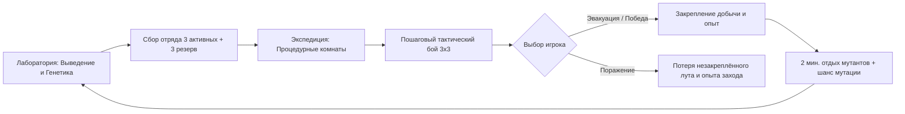

# Mutant Lab — Game Design Document (v0.2)

## 1. Концепция и фантазия игрока
> **«Ты — исследователь заброшенных лабораторий корпорации Genesis. Ты добываешь запрещённую ДНК, выводишь уникальных боевых мутантов, собираешь тактические отряды и отправляешься в опасные процедурные экспедиции, чтобы раскрыть тайну катастрофы и добыть редчайшие мутагены».**

Основной цикл игры (Core Game Loop):

---

## 2. Стихийная система (6 элементов)

В игре действуют 6 базовых стихий:
1. **Плазма (Plasma)**
2. **Крио (Cryo)**
3. **Электро (Electro)**
4. **Токсин (Toxin)**
5. **Тень (Shadow)**
6. **Биомасса (Biomass)**

### 2.1. Матрица взаимодействий
Стихии взаимодействуют по двум взаимосвязанным кругам превосходства и уязвимости (1.5× урон при преимуществе, 0.75× при сопротивлении):

* **Круг Энергии и Материи:**
  * **Плазма** плавит **Крио** (Плазма → Крио)
  * **Крио** замораживает **Биомассу** (Крио → Биомасса)
  * **Биомасса** поглощает **Электро** (Биомасса → Электро)
  * **Электро** перегружает **Плазму** (Электро → Плазма)
* **Аспекты Скрытности и Распада:**
  * **Токсин** разлагает органику и структуры **Биомассы** и **Крио** (Токсин эффективен против живого)
  * **Тень** поглощает чистую энергию **Плазмы** и импульсы **Электро**
  * **Электро** и **Плазма** рассеивают **Тень**

| Атакующий \ Защитник | Плазма | Крио | Электро | Токсин | Тень | Биомасса |
|---|:---:|:---:|:---:|:---:|:---:|:---:|
| **Плазма** | 1.0× | **1.5×** | 0.75× | 1.0× | 0.75× | 1.0× |
| **Крио** | 0.75× | 1.0× | 1.0× | 1.0× | 1.0× | **1.5×** |
| **Электро** | **1.5×** | 1.0× | 1.0× | 1.0× | **1.5×** | 0.75× |
| **Токсин** | 1.0× | **1.5×** | 1.0× | 1.0× | 1.0× | **1.5×** |
| **Тень** | **1.5×** | 1.0× | **1.5×** | 1.0× | 1.0× | 0.75× |
| **Биомасса** | 1.0× | 0.75× | **1.5×** | 0.75× | 1.0× | 1.0× |

*Все остальные не указанные сочетания являются нейтральными (1.0×).*

### 2.2. Артефакт «Ядро пустоты» (Void Core)
* Расходуемый предмет перед походом.
* При применении на мутанта полностью нивелирует стихийные множители: мутант наносит 1.0× по всем врагам и получает ровно 1.0× от всех атак.
* Убирает слабости, но лишает преимуществ. Действует ровно на одну экспедицию.

---

## 3. Генетическая система и внешний вид

### 3.1. Структура генома
* У каждого мутанта есть набор генов, значения которых выражаются в **абсолютных единицах** (а не в процентах от 100).
* Повышение одного гена не снижает значения других.
* Доступное количество слотов под гены растёт вместе с **Тиром (Tier)** мутанта:
  * **Tier 1**: 3 гена.
  * **Tier 2**: 4 гена.
  * **Tier 3**: 5 генов.
* Если мутант получает новый ген при заполненных слотах, новый ген **вытесняет ген с наименьшим числовым значением**.

### 3.2. Расчёт стихийного профиля и внешности
Внешний вид мутанта и его боевые стихии определяются ранжированием генов по силе:
* **При 3 генах (Tier 1):**
  * 2 сильнейших гена полностью определяют стихии (атака/защита) и внешний вид. 3-й ген является пассивным резервом.
* **При 4 генах (Tier 2):**
  * 2 сильнейших гена действуют на 100%.
  * 3-й по силе ген действует на **50%** силы эффектов и **определяет мутационный подвид/визуальные детали**.
  * 4-й ген скрыт.
* **При 5 генах (Tier 3):**
  * 3 сильнейших гена полностью (100%) формируют гибридную стихийную форму и внешний вид. Остальные 2 гена скрыты.

---

## 4. Способности, роли и защита

У каждого мутанта ровно **3 способности**, открывающиеся по мере прогресса:

1. **Базовая способность (Основная атака):**
   * Определяется главным преобладающим геном.
   * Наносит стихийный урон ведущего элемента и **пополняет общий пул энергии команды**.
   * Если в результате мутаций преобладающим становится другой ген, базовая атака автоматически трансформируется.

2. **Ролевая способность:**
   * Определяется выбранной игроком боевой ролью.
   * Всего в игре **5 ролей**:
     1. **Атакующий (Striker)**: мощный точечный или пробивающий урон.
     2. **Защитник (Guardian)**: способность наложения щитов и принудительная **провокация (Taunt)**, стягивающая атаки врагов на себя.
     3. **Лекарь (Healer)**: восстановление здоровья союзникам, снятие отрицательных эффектов.
     4. **Усилитель (Buffer)**: баффы на скорость, силу атаки, генерацию энергии.
     5. **Контролёр (Controller)**: оглушение, замедление, заморозка, блокировка способностей врага.
   * Роль выбирается при развитии блоба и может быть изменена в лаборатории за специальный реагент.

3. **Суперспособность (Ultimate):**
   * Открывается при максимальной прокачке мутанта.
   * Зависит от сочетания и баланса генов, определяющих текущий вид мутанта. При изменении вида суперспособность автоматически пересчитывается.
   * Требует большого количества энергии и имеет кулдаун ходов.

4. **Пассивная авто-защита (Guard):**
   * Не занимает слот действия и не тратит ход.
   * Срабатывает автоматически при вражеской атаке с шансом, зависящим от защитных генов (например, Биомасса/Крио). Снижает входящий урон на 50%.

---

## 5. Боевая система (3v3 Turn-Based)

Механика вдохновлена классическими пошаговыми RPG и *Clair Obscur: Expedition 33*.

### 5.1. Формирование отряда
* Отряд включает до **6 ячеек**:
  * **3 активных мутанта** (основная тройка на поле боя).
  * **До 3 резервных мутантов** (слоты открываются прокачкой лаборатории или покупкой ячеек).
* В бою одновременно участвуют только 3 мутанта.

### 5.2. Правило вступления резерва
* Резерв выходит на поле боя **только при полной гибели всех 3 активных мутантов**.
* Бой продолжается непрерывно: **враги сохраняют весь полученный урон, эффекты и текущие кулдауны**.
* Команда резерва наследует оставшийся запас командной энергии.
* Если бой выигран резервом, после боя **все павшие мутанты основной тройки полностью воскрешаются**.

### 5.3. Очередь ходов и энергия
* **Инициатива**: очередь ходов выстраивается динамически по параметру **Speed** среди всех участников (союзников и врагов). Каждый участник ходит 1 раз за раунд.
* **Общая энергия команды**:
  * Энергия едина для всех мутантов команды.
  * Каждый раунд пассивно начисляется фиксированное количество энергии (+2).
  * Базовые атаки генерируют энергию (+1...+2).
  * Мощные ролевые приёмы и суперспособности расходуют энергию.
  * Бой начинается с небольшим стартовым запасом (хватает на 1 недорогой навык).

### 5.4. Завершение боя и восстановление
* Между боями внутри экспедиции здоровье всей команды **полностью восстанавливается до 100%**.
* Сложность каждого следующего боя определяется силой противников, а не накопленными ранами.

---

## 6. Экспедиции и эвакуация

### 6.1. Структура экспедиции
* Экспедиции имеют фиксированную протяженность: **3 комнаты** (короткая вылазка) или **5 комнат** (углублённая).
* Входная зона и финальная комната сектора сюжетно оформлены; промежуточные залы, развилки, лут и монстры генерируются процедурно.
* Игрок свободно исследует комнаты персонажем от 3-го лица. При соприкосновении с монстром камера переходит в режим пошаговой арены.

### 6.2. Закрепление лута и эвакуация
* В промежутках между комнатами расположены **терминалы эвакуации и капсулы отправки добычи**.
* Игрок может:
  1. Закрепить найденные образцы ДНК и ресурсы через терминал.
  2. Добровольно эвакуироваться в лабораторию, забрав всю добычу и полученный опыт.
  3. Использовать одноразовый прибор «Дрон-курьер» прямо в поле для отправки части лута.
* **Правило поражения**:
  * Если погибает вся шестёрка отряда (основа + резерв), **теряется вся незакреплённая добыча и весь опыт текущей экспедиции**.
  * Ранее закреплённые образцы и сами мутанты никогда не теряются безвозвратно.

### 6.3. Кулдаун отдыха и пост-экспедиционная мутация
* После успешной эвакуации или победы все блобы отряда уходят на **2-минутный отдых** (не могут идти в новый поход).
* По окончании отдыха начисляется прогресс тира, и каждый участник экспедиции (включая резерв) имеет шанс получить **случайную бонусную мутацию** (прирост гена, аналогично воздействию мутагена).
* При полном поражении отдыха нет — игрок может сразу повторить попытку другим или тем же составом.

---

## 7. Скрещивание (Breeding) и эволюция

* **Механика поглощения:**
  * Скрещивание объединяет двух мутантов: один **выживает**, второй **расходуется (поглощается)**.
  * Выживший блоб получает случайную часть одного гена поглощённого (включая гены, которых у него не было).
* **Шанс выживания:**
  * Одинаковый тир: **50% на 50%**.
  * Разные тиры: преимущество у старшего тира (вероятность потери сильного стремится к минимуму, но никогда не равна нулю).
* **Эволюция Тиров:**
  * Скрещивание **НЕ повышает тир**.
  * Тир мутанта повышается **исключительно за счёт участия в экспедициях и набора боевого опыта**.
