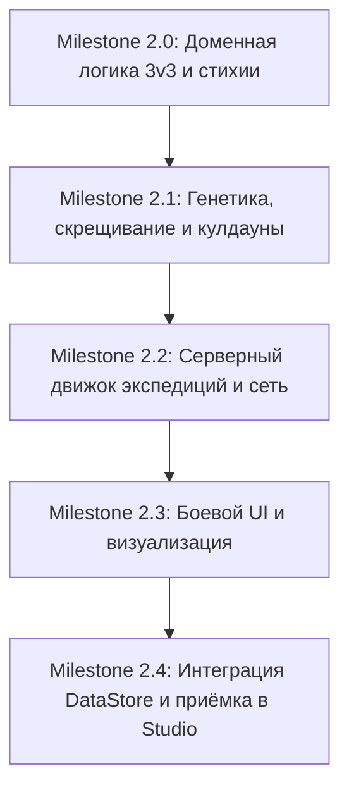

# Mutant Lab — Дорожная карта разработки (Roadmap)

Данный документ определяет последовательность этапов перехода проекта от тестового прототипа кликера (v0.1) к полнофункциональной тактической RPG с экспедициями и пошаговыми боями 3х3 (v0.2).

---

## Архитектурные принципы переходов между этапами
1. **Никаких тупиков для данных**: Новые структуры данных проектируются с версионированием (`DataVersion = 2`) и обратной совместимостью для старых сохранений.
2. **Чистый домен (Pure Luau Domain)**: Вся математика урона, стихий, мутаций, очередей ходов и проверок пишется без зависимости от глобальных сервисов Roblox, что позволяет тестировать её через `Lune` мгновенно.
3. **Строгая серверная валидация**: Клиент передает только интенты (действие, цель, способность). Сервер полностью моделирует бой и подтверждает результаты.

---

## Этапы разработки v0.2

---

### Milestone 2.0: Доменная логика стихий и пошагового боя 3v3
**Цель**: Автономный математический движок пошагового боя и стихий, полностью покрытый тестами в Lune.
* [x] **2.0.1. Стихийная матрица (`ElementMatrix.luau`)**:
  * Реализация 6 стихий: Plasma, Cryo, Electro, Toxin, Shadow, Biomass.
  * Таблица синергий, уязвимостей (1.5x) и сопротивлений (0.75x).
  * Поддержка эффекта «Void Core» (нейтрализация множителей).
* [x] **2.0.2. Расчёт характеристик мутанта (`MutantStats.luau`)**:
  * Вычисление эффективных стихий по количеству генов (3 гена -> 2 стихии; 4 гена -> 2 + 50% 3-й; 5 генов -> 3 стихии).
  * Расчёт скорости (Speed), базового урона, здоровья и шанса авто-защиты.
* [x] **2.0.3. Движок пошагового боя (`CombatEngine.luau`)**:
  * Инициализация двух команд (до 3 активных + до 3 в резерве).
  * Динамическая шкала очередности ходов по параметру `Speed`.
  * Общий пул энергии команды (пассивный приток каждый раунд, генерация базовыми атаками, трата на навыки).
  * Механика провокации (Taunt) у роли Защитник.
  * Механика вступления резерва: срабатывает ровно при гибели всех 3 активных бойцов, с сохранением состояния и урона противников.
* [x] **2.0.4. Набор unit-тестов в Lune (`tests/combat-engine.spec.luau`, `tests/elements.spec.luau`)**:
  * 100% покрытие граничных случаев: уязвимости, авто-защита, нехватка энергии, гибель и вход резерва, победа/поражение.

---

### Milestone 2.1: Генетика, скрещивание и кулдауны
**Цель**: Доменные сервисы для мутаций, селекции и управления состоянием отдыха.
* [x] **2.1.1. Модель селекции (`BreedingService.luau`)**:
  * Вероятностный алгоритм поглощения: 50/50 при равных тирах, сдвиг вероятности в сторону старшего тира при разных тирах.
  * Наследование части числового значения одного случайного гена жертвы.
  * Вытеснение наименьшего гена при превышении лимита слотов тира.
* [x] **2.1.2. Механика отдыха и мутаций (`RestCooldownService.luau`)**:
  * 2-минутный таймер недоступности мутантов после похода.
  * Генерация случайной бонусной мутации по окончании отдыха.
* [x] **2.1.3. Тесты селекции (`tests/breeding.spec.luau`)**.

---

### Milestone 2.2: Серверный движок экспедиций и сетевой протокол
**Цель**: Управление экспедициями на стороне сервера, генерация комнат и валидация действий игрока.
* [x] **2.2.1. Генератор структуры экспедиций (`ExpeditionGenerator.luau`)**:
  * Генерация цепочек комнат (3 или 5 комнат).
  * Размещение промежуточных терминалов эвакуации и капсул закрепления лута.
  * Спавн вражеских отрядов со стихийными модификаторами сектора.
* [x] **2.2.2. Сетевой контракт v2 (`docs/NETWORK.md` + `Remotes`)**:
  * Удаленные функции: `StartExpedition`, `SelectCombatAction({TargetId, AbilityIndex})`, `UseItem`, `SecureLoot`, `Evacuate`.
  * Серверные события: `CombatTurnChanged`, `CombatActionResolved`, `ExpeditionRoomCompleted`.
* [x] **2.2.3. Защита от десинхронизации и античит**:
  * Сервер авторитарно рассчитывает урон и очередь. Клиент отправляет только намерения.
  * Защита от спама запросов через существующий `RateLimiter`.

---

### Milestone 2.3: Клиентский интерфейс и визуал боя
**Цель**: Удобный тактический UI пошаговой битвы и визуализация происходящего.
* [x] **2.3.1. Тактический боевой HUD (`CombatUI.luau`)**:
  * Шкала инициативы (Timeline ходов мутантов и противников).
  * Индикатор командной энергии (энергетические ячейки).
  * Кнопки способностей с кулдаунами и стоимостью.
  * Выбор цели (индикация уязвимости/сопротивления над целью перед ударом).
* [x] **2.3.2. Интерфейс отряда (`SquadUI.luau`)**:
  * Выбор 3 активных и до 3 резервных бойцов перед вылазкой.
  * Визуальное отображение стихий, генов и ролей.
* [x] **2.3.3. Визуализация исследования и арены**:
  * Свободное перемещение исследователя по комнатам.
  * Бесшовный вход в боевой режим при приближении к патрулю врагов.

---

### Milestone 2.4: Интеграция с DataStore и приёмка в Studio
**Цель**: Надежное сохранение обновленной структуры игрока и комплексное тестирование.
* [x] **2.4.1. Миграция профиля (`GameState.luau`)**:
  * `DataVersion = 2`.
  * Хранение массива генов у каждого мутанта, его роли, уровня тира и кулдауна отдыха.
  * Сохранение закрепленного лута экспедиций.
* [x] **2.4.2. Автоматические интеграционные тесты**:
  * Запуск `scripts/check.ps1` (StyLua + Lune + сборка Rojo `MutantLab.rbxlx`).
* [ ] **2.4.3. Ручная приёмка в Roblox Studio**:
  * Прогон чек-листа в Studio: полный цикл вылазки на 3 комнаты, пошаговый бой, выход резерва, эвакуация, отдых и скрещивание.
